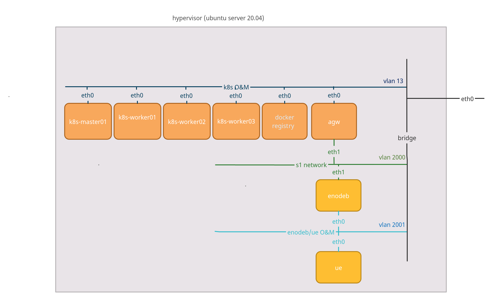

## MAGMA orc8r/agw and Opencells enodeb/ue deployment

### Topology:

## Steps:
<!-- TOC -->
- [1 - Debian 9 image: Used for k8s cluster, docker register and AGW](docs/debian_9_vm.md)

- [2 - Ubuntu 18.04: Used for enodeb/ue opencells (optional) ](docs/ubuntu_18_04_vm.md)

- [3 - Create the virtual machines for k8s, nfs and register ](docs/k8s_vm.md)

- [4 - Create the virtual machines for k8s, nfs and register ](docs/agw_vm.md)

- [5 - Create the virtual machines enodeb and ue (optional) ](docs/opencells.md)

- [6 - Deploy orc8r and nms ](docs/deploy_magma.md)

- [7 - Install agw ](docs/deploy_agw.md)
<!-- TOC -->