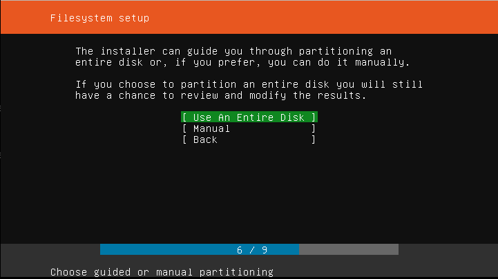
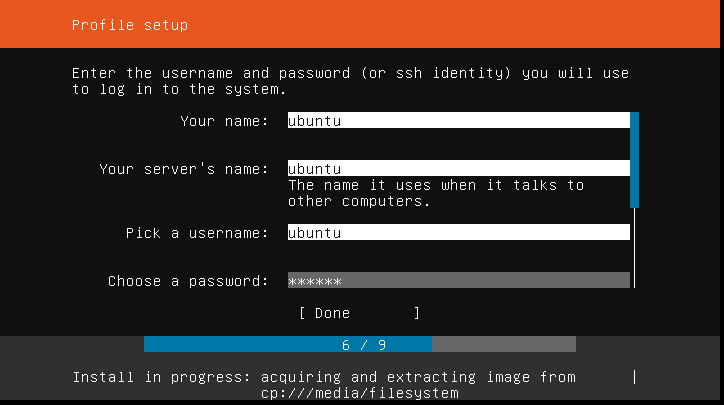

# 1 - Create virtual machine images

## 1.1 -  Debian 9 image (Used for k8s cluster, docker registery and agw virtual machine):

In order to start, install debian 9 virtual machine  from this [URL](https://cdimage.debian.org/cdimage/archive/9.13.0/amd64/iso-cd/debian-9.13.0-amd64-netinst.iso):

At the hypervisor (Ubuntu 20.04), execute the following commands:

```shell
apt install -y virt-manager qemu-kvm wget 
mkdir -p /srv/image
cd /srv/image
wget https://cdimage.debian.org/cdimage/archive/9.13.0/amd64/iso-cd/debian-9.13.0-amd64-netinst.iso
qemu-img create debian.img 40G
qemu-system-x86_64 \
    -enable-kvm \
    -no-reboot \
    -m 1024 \
    -drive file=debian.img,format=raw,cache=none \
    -cdrom debian-9.13.0-amd64-netinst.iso \
    -vnc :0
```

Open a vncviwer to the server's IP, port 0. Example:

```shell
vncviewer 10.2.1.31:0
```

And choose the options:


User setting:


Disk partition:


And install only the following packages:


Once instalation is complete, start virtual machine without iso using the following command:
```shell
qemu-system-x86_64 \
    -enable-kvm \
    -no-reboot \
    -m 1024 \
    -drive file=debian.img,format=raw,cache=none \
    -vnc :0
```

And connect using vnc command. Login with debian account, and change to root using "su - "

Update system and install sudo:
```bash 
apt update && apt upgrade -y
apt install -y sudo
```

Add the following line in /etc/sudoers file:

```bash 
debian ALL=(ALL:ALL) NOPASSWD:ALL
```

Edit the line in /etc/default/grub file:

From:
```bash 
GRUB_CMDLINE_LINUX=""
```

To:
```bash 
GRUB_CMDLINE_LINUX="net.ifnames=0 biosdevname=0"
```

And execute the command:
```bash 
grub-mkconfig -o /boot/grub/grub.cfg
```

Change back to debian user and create the ssh files:
```bash 
su - debian
ssh-keygen -t rsa
touch /home/debian/.ssh/authorized_keys
```

Execute the following workaround to reduce the disk usage (reference [here](https://balau82.wordpress.com/2011/05/08/qemu-raw-images-real-size/)):

```bash
dd if=/dev/zero of=/tmp/tmpzeros
```
It will run for a while, and fill the emulated hard disk with zero values. The real size of the file on the host filesystem will grow to reach its maximum. It should stop when there’s no more disk space, but it can also be interrupted with Ctrl-C. Then run:

```bash
sync
rm /tmp/tmpzeros
```

Poweroff virtual machine:

```bash
poweroff
```

Run:
```bash
qemu-img convert -f raw -O raw debian.img debian-0.img
rm debian.img
mv debian-0.img debian.img
```

## 1.2 -  Ubuntu 18.04 image (Used by [opencells](https://open-cells.com/) - enodeb and ue  virtual machines):
At the hypervisor (Ubuntu 20.04), execute the following commands:

```shell
cd /srv/image
wget http://old-releases.ubuntu.com/releases/18.04.4/ubuntu-18.04-live-server-amd64.iso
qemu-img create ubuntu.img 40G
qemu-system-x86_64 \
    -enable-kvm \
    -no-reboot \
    -m 1024 \
    -drive file=ubuntu.img,format=raw,cache=none \
    -cdrom ubuntu-18.04-live-server-amd64.iso \
    -vnc :0
```

Open a vncviwer to the server's IP, port 0. Example:

```shell
vncviewer 10.2.1.31:0
```

Disk configuration:



User configuration:



Once instalation is complete, start virtual machine without iso using the following command:
```shell
qemu-system-x86_64 \
    -enable-kvm \
    -no-reboot \
    -m 1024 \
    -drive file=ubuntu.img,format=raw,cache=none \
    -vnc :0
```

And connect using vnc command. Login with debian account, and change to root using "su - "

Update system:
```bash 
sudo su - 
apt update && apt upgrade -y
reboot
```

Create the "cloud" user:
```
useradd -m cloud -s /bin/bash
```

Add the following line in /etc/sudoers file:

```bash 
cloud ALL=(ALL:ALL) NOPASSWD:ALL
```

Edit the line in /etc/default/grub file:

From:
```bash 
GRUB_CMDLINE_LINUX=""
```

To:
```bash 
GRUB_CMDLINE_LINUX="net.ifnames=0 biosdevname=0"
```

And execute the command:
```bash 
grub-mkconfig -o /boot/grub/grub.cfg
```

Change back to debian user and create the ssh files:
```bash 
su - cloud
ssh-keygen -t rsa
touch /home/cloud/.ssh/authorized_keys
```

Poweroff virtual machine:

```bash
poweroff
```

# 2 - Create the vms for k8s and register

Install the required packages on your computer:
```bash
pip3 install pyaml
sudo apt install -y ansible
ansible-galaxy collection install community.libvirt
```

Deploy the virtual machines (edit the file k8s_vm_config.yml first):
```bash
cd magma
cat k8s_vm_config.yml > libvirt-lab-debian/config.yml
python3 k8s_hosts.py k8s_vm_config.yml > libvirt-lab-debian/hosts
cd libvirt-lab-debian
time ANSIBLE_HOST_KEY_CHECKING=False ansible-playbook -i hosts create_vm.yml

```

After vm initialization, start the magma image compilation:

```bash 
cd magma
python3 k8s_hosts.py k8s_vm_config.yml > k8s/hosts
cat k8s_vm_config.yml > k8s/config.yml
cd k8s
time ANSIBLE_HOST_KEY_CHECKING=False ansible-playbook -i hosts 01_compile.yml
```

Prepare register to upload the images:
```bash
time ANSIBLE_HOST_KEY_CHECKING=False ansible-playbook -i hosts 01_prepare_registery.yml
```

Connect to the register and upload the images manually:
```
ssh debian@10.5.0.32 
sudo su - 
bash /tmp/upload.sh upload
exit
```

Deploy k8s cluster:
```bash
time ANSIBLE_HOST_KEY_CHECKING=False ansible-playbook -i hosts 02_install_k8s_with_docker.yml
```

Once k8s is installed, copy kubeconfig to your kube directory:
```bash
cp kubeconfig ~/.kube/config
```

To enable autocompletion:
```bash
source <(kubectl completion bash)
```

Once k8s cluster is running, deploy magma using the follwing guide:
[Deploy Magma](deploy_magma.md)

To install agw:
[Deploy AGW](deploy_agw.md)

# 3 - Create the vms for opencells enodeb and ue

Execute the following commands to deploy the enodeb and ue virtual machines (edit enodeb_ue_vm_config.yml first):

```bash
cd magma
cat enodeb_ue_vm_config.yml > libvirt-lab-ubuntu-server_18.04/config.yml
cd libvirt-lab-ubuntu-server_18.04
```

Create the inventory file containing the IPs of enodeb and ue:

```bash
cat << EOF > hosts
[hypervisor]
10.2.1.31

[nodes]
10.10.1.20
10.10.1.21
EOF
```

Execute the playbook:
``` bash 
time ANSIBLE_HOST_KEY_CHECKING=False ansible-playbook -i hosts create_vm.yml
```

Update vms:
``` bash 
time ANSIBLE_HOST_KEY_CHECKING=False ansible-playbook -i hosts update_vm.yml
```

Enter create the configuration file and inventory file for opencells nodes:
```bash
cd magma
cat enodeb_ue_vm_config.yml > opencells/config.yml
cd opencells
cat << EOF > hosts
[hypervisor]
10.2.1.31

[enodeb]
10.10.1.20

[ue]
10.10.1.21

[nodes]
10.10.1.20
10.10.1.21

EOF
```

Build opencells:
``` bash 
time ANSIBLE_HOST_KEY_CHECKING=False ansible-playbook -i hosts install_opencells.yml
```


Configure ue and enodeb:
``` bash 
time ANSIBLE_HOST_KEY_CHECKING=False ansible-playbook -i hosts configure.yml
```


To connect enodeb with agw, execute the following command:
```bash
/root/openairinterface5g/cmake_targets/ran_build/build/lte-softmodem --rfsim -O ~/opencells-mods/enb.sample --log_config.hw_log_level error
```

To connect UE to enodeb, execute (Considering enodeb ip = 10.10.1.20):
```bash
cd ~
rm -rf ~/ue01
mkdir ~/ue01
cd ~/ue01
~/openairinterface5g/cmake_targets/nas_sim_tools/build/conf2uedata -c ~/opencells-mods/sim_modified.conf -o .
cd ~/ue01 && /root/openairinterface5g/cmake_targets/ran_build/build/lte-uesoftmodem -C 2685000000 -r 50 --rfsim --rfsimulator.serveraddr 10.10.1.20
```

Once UE is attached, create the static route to your computer to avoid connection loss:
```bash
ip route add 10.2.1.0/24 via 10.10.1.1 dev eth0
ip route del default
ip route add default dev oaitun_ue1
```

Install speedtest in UE:
```bash
apt-get install gnupg1 apt-transport-https dirmngr -y
export INSTALL_KEY=379CE192D401AB61
apt-key adv --keyserver keyserver.ubuntu.com --recv-keys $INSTALL_KEY
echo "deb https://ookla.bintray.com/debian generic main" | tee  /etc/apt/sources.list.d/speedtest.list
apt-get update
apt-get install speedtest -y
speedtest
```