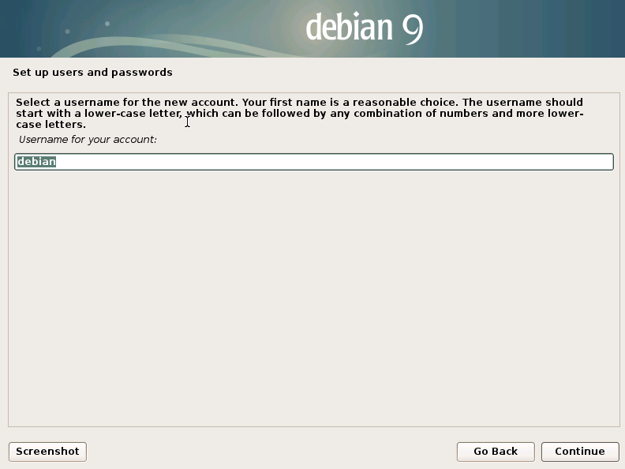
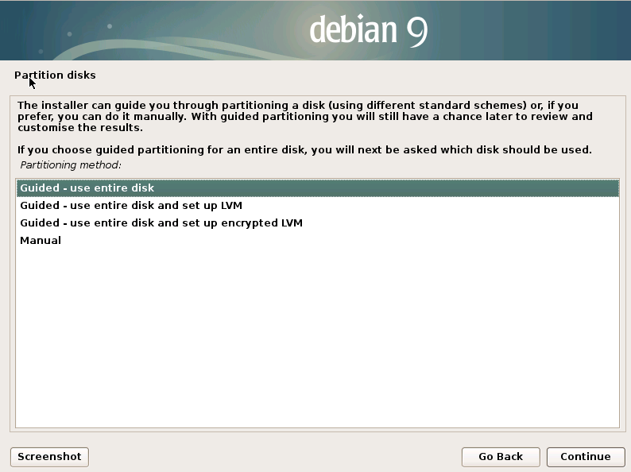
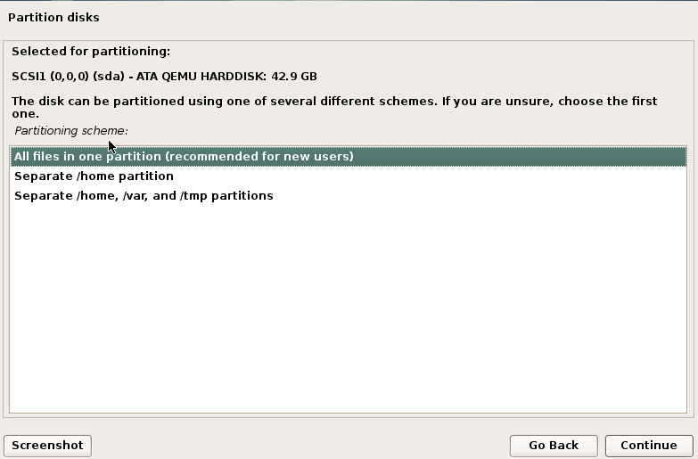
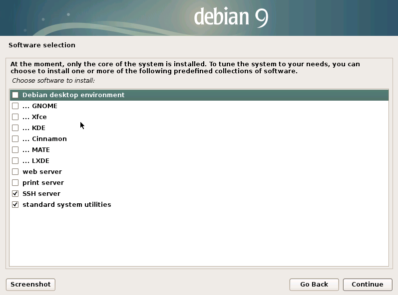

## Debian 9 image (Used for k8s cluster, docker registery and agw virtual machine):

In order to start, install debian 9 virtual machine  from this [URL](https://cdimage.debian.org/cdimage/archive/9.13.0/amd64/iso-cd/debian-9.13.0-amd64-netinst.iso):

At the hypervisor (Ubuntu 20.04), execute the following commands:

```shell
apt install -y virt-manager qemu-kvm wget 
mkdir -p /srv/image
cd /srv/image
wget https://cdimage.debian.org/cdimage/archive/9.13.0/amd64/iso-cd/debian-9.13.0-amd64-netinst.iso
qemu-img create debian.img 40G
qemu-system-x86_64 \
    -enable-kvm \
    -no-reboot \
    -m 1024 \
    -drive file=debian.img,format=raw,cache=none \
    -cdrom debian-9.13.0-amd64-netinst.iso \
    -vnc :0
```

Open a vncviwer to the server's IP, port 0. Example:

```shell
vncviewer 10.2.1.31:0
```

And choose the options:


User setting:




Disk partition:





And install only the following packages:




Once instalation is complete, start virtual machine without iso using the following command:
```shell
qemu-system-x86_64 \
    -enable-kvm \
    -no-reboot \
    -m 1024 \
    -drive file=debian.img,format=raw,cache=none \
    -vnc :0
```

And connect using vnc command. Login with debian account, and change to root using "su - "

Update system and install sudo:
```bash 
apt update && apt upgrade -y
apt install -y sudo
```

Add the following line in /etc/sudoers file:

```bash 
debian ALL=(ALL:ALL) NOPASSWD:ALL
```

Edit the line in /etc/default/grub file:

From:
```bash 
GRUB_CMDLINE_LINUX=""
```

To:
```bash 
GRUB_CMDLINE_LINUX="net.ifnames=0 biosdevname=0"
```

And execute the command:
```bash 
grub-mkconfig -o /boot/grub/grub.cfg
```

Change back to debian user and create the ssh files:
```bash 
su - debian
ssh-keygen -t rsa
touch /home/debian/.ssh/authorized_keys
```

Execute the following workaround to reduce the disk usage (reference [here](https://balau82.wordpress.com/2011/05/08/qemu-raw-images-real-size/)):

```bash
dd if=/dev/zero of=/tmp/tmpzeros
```
It will run for a while, and fill the emulated hard disk with zero values. The real size of the file on the host filesystem will grow to reach its maximum. It should stop when there’s no more disk space, but it can also be interrupted with Ctrl-C. Then run:

```bash
sync
rm /tmp/tmpzeros
```

Poweroff virtual machine:

```bash
poweroff
```

Run:
```bash
qemu-img convert -f raw -O raw debian.img debian-0.img
rm debian.img
mv debian-0.img debian.img
```


[<< Back](README.md)