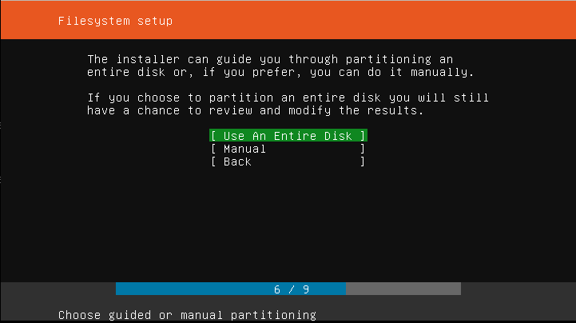
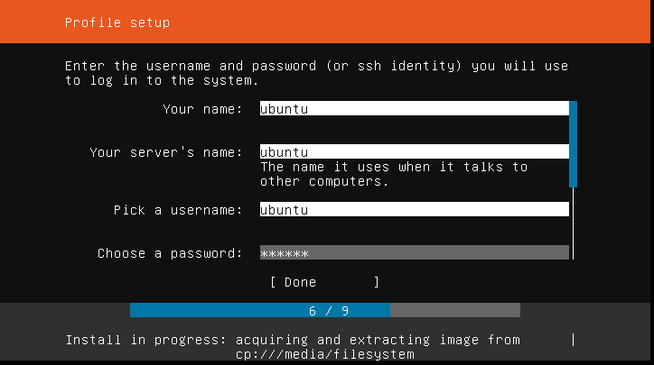

## Ubuntu 18.04 image (Used by [opencells](https://open-cells.com/) - enodeb and ue  virtual machines):
At the hypervisor (Ubuntu 20.04), execute the following commands:

```shell
cd /srv/image
wget https://releases.ubuntu.com/18.04/ubuntu-18.04.5-live-server-amd64.iso
qemu-img create ubuntu.img 40G
qemu-system-x86_64 \
    -enable-kvm \
    -no-reboot \
    -m 1024 \
    -drive file=ubuntu.img,format=raw,cache=none \
    -cdrom ubuntu-18.04.5-live-server-amd64.iso \
    -vnc :0
```

Open a vncviwer to the server's IP, port 0. Example:

```shell
vncviewer 10.2.1.31:0
```

Disk configuration:



User configuration:



Once instalation is complete, start virtual machine without iso using the following command:
```shell
qemu-system-x86_64 \
    -enable-kvm \
    -no-reboot \
    -m 1024 \
    -drive file=ubuntu.img,format=raw,cache=none \
    -vnc :0
```

And connect using vnc command. Login with debian account, and change to root using "su - "

Update system:
```bash 
sudo su - 
apt update && apt upgrade -y
reboot
```

Create the "cloud" user:
```
useradd -m cloud -s /bin/bash
```

Add the following line in /etc/sudoers file:

```bash 
cloud ALL=(ALL:ALL) NOPASSWD:ALL
```

Edit the line in /etc/default/grub file:

From:
```bash 
GRUB_CMDLINE_LINUX=""
```

To:
```bash 
GRUB_CMDLINE_LINUX="net.ifnames=0 biosdevname=0"
```

And execute the command:
```bash 
grub-mkconfig -o /boot/grub/grub.cfg
```

Change back to debian user and create the ssh files:
```bash 
su - cloud
ssh-keygen -t rsa
touch /home/cloud/.ssh/authorized_keys
```

Poweroff virtual machine:

```bash
poweroff
```

[<< Back](../README.md)